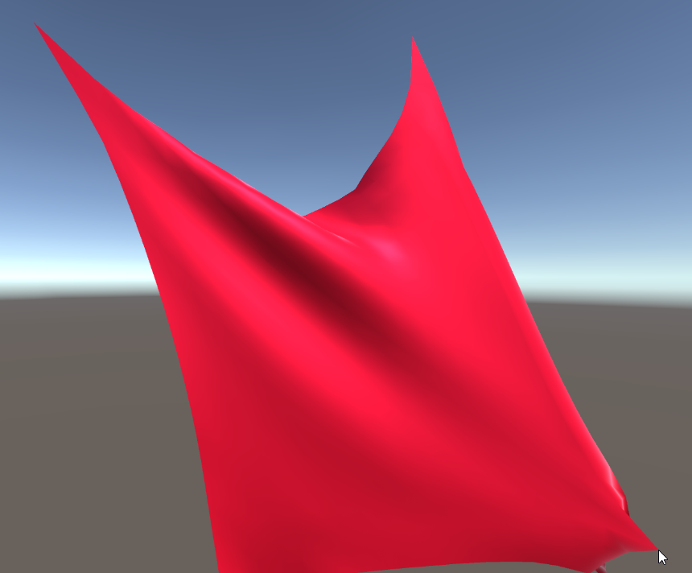
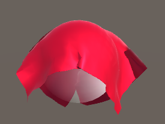

## Overview

This project aims to implement a powerful method of simulating deformable bodies within Unity, known as Extended Position Based Dynamics (XPBD). The focus of this simulation is on cloth objects, showcasing how they interact with external forces and maintaining computational efficiency.

## Features

- **XPBD Implementation**: A robust method to simulate cloth dynamics.
- **Comparison with Other Methods**: Includes Mass-Spring System and Original Position Based Dynamics (PBD) for performance comparison.
- **Integration with Unity**: Utilizes C# for Unity scripts (mesh creation, user interaction, recording) and C++ for the main simulation loop. Integrates with unity by treating the C++ code as a DLL plugin.
- **User Interaction**: Real-time manipulation and interaction with the cloth using the mouse.
- **Experiment Recording**: Record and playback different simulation scenarios, with the ability to queue up any number of experiments.

## Scenarios

The project includes two main scenarios for testing:
1. Vertical Cloth:
   -  A cloth object pinned at two points.
   -  Useful for testing hanging cloth dynamics and observing constraints.

2. Horizontal Cloth on Sphere:
   -   A cloth falling and interacting with a rigid sphere.
   -   Demonstrates collision and draping behavior.

## Screenshots
  

## Results

- XPBD demonstrated superior stability and performance compared to the mass-spring system.
- C++ implementation provided significant performance benefits over C# in the context of a physics simulation.
- XPBD improved upon PBD by decoupling stiffness from solver iterations, leading to more stable simulations under varying time steps.

## Future Work

- The collision implementation is very basic, requires self-collision.
- A new scenario featuring a character wearing clothes simulated by this method
- Potential GPU implementation
